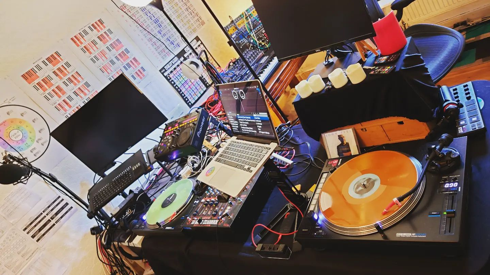

Audio and music has always been a big part of my life, which I used to actively pursue in the evenings while working in software/IT.

* I have DJ'd semi-professionally, with stints in club residencies, mobile DJing and Twitch DJing, for over a decade. I also produced and released several electronica albums.
* I have done paid freelance work on sound design and studio building.
* I studied the core parts of a Bachelors degree in Sound Engineering and Music Production, as a distance learning course while I was working full-time, at the excellent Point Blank Music School in London. I have also done a lot of self-study in music theory, sound design, and audio engineering.

I am not currently putting as much time into music as I would like any more, because now I'm in my 40s it has been difficult to keep 'burning the candle at both ends'. However I still enjoy playing my synths, live music, and listening to music on my custom listening setup.

## Albums and EPs Released

My 'Socialist Synthesis' project is an experimental/electronica/ambient/soundscape project. I have released several albums under this project:
* [Summer Sun Highway by Socialist Synthesis](https://socialistsynthesis.bandcamp.com/album/summer-sun-highway)
* [Sound Escapes by Socialist Synthesis](https://socialistsynthesis.bandcamp.com/album/sound-escapes)

I have released an EP under the 'Machines Move Mountains' project with Ellis Breen. It is experimental/electronica/downtempo:
* [Unfinished Dreams by Machines Move Mountains](https://machinesmovemountains.bandcamp.com)

I have released a few tracks under the 'Concrete Spectre' project. It is industrial/EBM/techno:
* [Concrete Spectre Bandcamp](https://concretespectre.bandcamp.com)

## DJing and Professional Music Industry Portfolio

This is my professional portfolio for the audio and music industry:
* [DavidCraddockAudio.com](https://DavidCraddockAudio.com)

