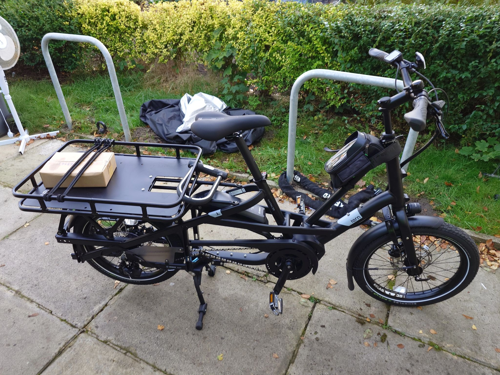

## Bike 1 - Electric Mountain Bike

I use this for mostly getting out of the city and into some nature. It is a long-range bike.

- Himiway Zebra Electric Mountain Bike 2023 Version (road legal, top electric-assisted speed 15mph, max. pull 400lbs)
- 2x official batteries (40-80 miles on a single charge each)
- 2x battery chargers
- Two spare tires
- Spare inner tube
- Electric fat tire pump
- Metal tire levers
- Adjustable wrench
- Chain tool for removing chain links
- Chain cleaner tool
- "MuckOff" bike cleaning kit
- Small first aid kit
- Compass
- Himiway fold-out cycle toolkit
- Energy bars + nuts
- 2x cycle frame bags
- 1x Rockbros waterproof dual pannier bag
- Rockbros Handlebar bag
- Rockbros Mobile phone holder bag
- Hornit Electric bike horn
- Bike bell
- 4x vaccum thermos 750ml flasks for water
- All-weather MTB grips for handlebar
- RAM grip quick release handlebar phone holder
- VEVOR Cycle Bike Cargo Trailer with hitch

## Bike 2 - City Electric Cargo Bike

My wife and I use this as a bike for getting shopping and a general-purpose car replacement, as well as volunteering.

- Tern 2024 Quick Haul Long D9 Electric Cargo Bike (road legal, top electric-assisted speed 15mph, max. pull 415lbs)
- Large cargo tray mount
- Hornit Electric bike horn
- Wireless security tag for the key of the Tern immobilisation lock
- RAM grip quick release handlebar phone holder
- Bike bell

## Clothes and Gear

A good set of cycling clothes is essential for comfortable all-weather all-year cycling, even in an area with a relatively 'mild' climate such as Manchester.

- Fingerless MTB gloves for warmer weather
- Wraparound anti-glare sun glasses for protection against surface dirt etc
- Wraparound cycle goggles with different visors
- Goretex water-resistant high-vis cycle jacket
- Light backpack suitable for cycling
- Thermal 'long johns'
- Heated rechargable motorbike style gloves
- Shorts with seat padding
- Leg and arm warmers
- Rockbros rechargable e-bike helmet helmet with built-in (powerful) LED front light with up and down action so not to blind drivers, and rear light

## Security

* 1x LiteLock X1 Angle-grinder Resistant Bike Lock (Diamond Motorbike Solid Secure Rated)
* 2x Sheffield Bike stands set in concrete in my garden
* 2x Oxford ground anchors set in concrete in my garden (Diamond Motorbike Solid Secure Rated)
* 1x Oxford giant chain and padlock (Gold Motorbike Solid Secure Rated / Diamond Bicycle Solid Secure Rated)
* CycleRegister security marking kits for both bikes
* Immobilise security marking kit and RFID tags for both bikes
* Insurance. Lots of insurance.

