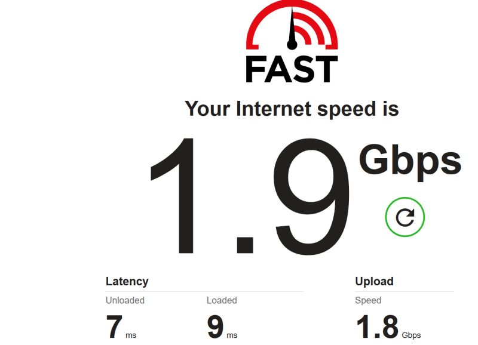
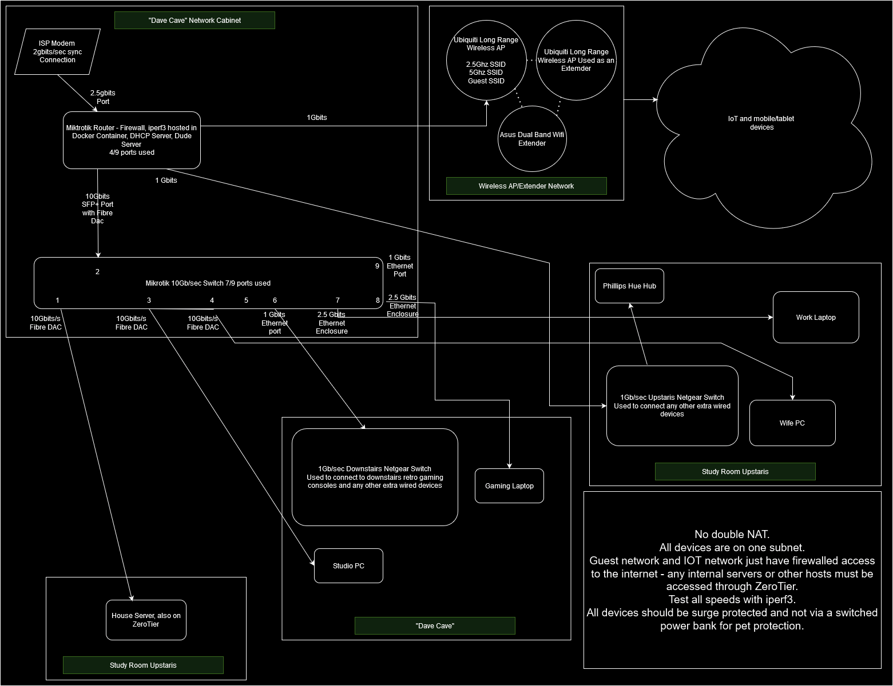

- I have a fibre to the house 2Gb/sec connection provided by [BRSK](https://www.brsk.co.uk), who I really recommend.
- My home network routes at around 2-4gbit/sec between 10gbit/sec DAC fibre connected hosts, and around 2gbit/sec via CAT8 for Thunderbolt 2.5Ggbit/sec laptop network interfaces.
- We two Ubiquiti wireless APs in a mesh configuration, with seperate SSIDs for 2Ghz, 5Ghz, guest and IOT networks. The guest and IOT networks are isolated from everything else.
- I use a Mikrotik router which hosts an iperf3 docker container for network testing
- I have a Google smart home setup with 2x Google Home Mini speakers, 1x Google Home Hub (1st) gen, 1x Google Doorbell, 1x Google Nest Smoke Alarm, 1x Google Nest Thermostat, and 2x Google Nest Cameras.
- We have a Phillips Hue light source setup, with 5 Hue lights in the Music Studio/Games room, which I set to strobe to music when I do my DJ sets, and setup as a Hue Entertainment Area when I play games/watch films. I also have Hue lights in the study and my bedroom, with dimmers etc.
- We have a robotic vacuum cleaner which helps Conny around the house. We call it 'Dusterbuster'.
- Wherever possible, all devices have a wired network connection. Wireless is only used as a last resort, to minimise spectrum interference.
- We use ZeroTier as a VPN so that everything useful is accessible outside the home.
- My home server runs about 14 docker containerized services of different types, using docker compose. I self-host my own websites (including this one), and a bunch of other services for my friends and family. See my [media library homepage](https://home.davidcraddock.net) which is a kind of 'intranet homepage' for my network.



Network diagram accurate as of 12-11-24:
[](https://davidcraddock.net/my-home-network/networkdiagram.png)

### Iperf3 Speed Tests

#### Studio PC -> Server network speed

```
[ ID] Interval           Transfer     Bitrate         Retr  Cwnd
[  5]   0.00-1.00   sec   354 MBytes  2.97 Gbits/sec    7   2.30 MBytes
[  5]   1.00-2.00   sec   380 MBytes  3.19 Gbits/sec    0   2.42 MBytes
[  5]   2.00-3.00   sec   386 MBytes  3.24 Gbits/sec    0   2.53 MBytes
[  5]   3.00-4.00   sec   385 MBytes  3.23 Gbits/sec    0   2.64 MBytes
[  5]   4.00-5.00   sec   386 MBytes  3.24 Gbits/sec    0   2.75 MBytes
[  5]   5.00-6.00   sec   380 MBytes  3.19 Gbits/sec    2   2.84 MBytes
[  5]   6.00-7.00   sec   386 MBytes  3.24 Gbits/sec   10   2.93 MBytes
[  5]   7.00-8.00   sec   384 MBytes  3.22 Gbits/sec    0   3.00 MBytes
[  5]   8.00-9.00   sec   386 MBytes  3.24 Gbits/sec    0   3.00 MBytes
[  5]   9.00-10.00  sec   385 MBytes  3.23 Gbits/sec    0   3.00 MBytes
- - - - - - - - - - - - - - - - - - - - - - - - -
[ ID] Interval           Transfer     Bitrate         Retr
[  5]   0.00-10.00  sec  3.72 GBytes  3.20 Gbits/sec   19             sender
[  5]   0.00-10.00  sec  3.72 GBytes  3.20 Gbits/sec                  receiver

iperf Done.

```

#### Server -> Router network speed

```
[ ID] Interval           Transfer     Bitrate         Retr  Cwnd
[  5]   0.00-1.00   sec   456 MBytes  3.83 Gbits/sec  1170    291 KBytes
[  5]   1.00-2.00   sec   407 MBytes  3.41 Gbits/sec  801    512 KBytes
[  5]   2.00-3.00   sec   286 MBytes  2.40 Gbits/sec    0    512 KBytes
[  5]   3.00-4.00   sec   286 MBytes  2.40 Gbits/sec    0    512 KBytes
[  5]   4.00-5.00   sec   456 MBytes  3.82 Gbits/sec  1269    344 KBytes
[  5]   5.00-6.00   sec   476 MBytes  4.00 Gbits/sec  1353    407 KBytes
[  5]   6.00-7.00   sec   485 MBytes  4.07 Gbits/sec  1440    348 KBytes
[  5]   7.00-8.00   sec   491 MBytes  4.12 Gbits/sec  1168    279 KBytes
[  5]   8.00-9.00   sec   489 MBytes  4.10 Gbits/sec  1229    256 KBytes
[  5]   9.00-10.00  sec   476 MBytes  4.00 Gbits/sec  1602    298 KBytes
- - - - - - - - - - - - - - - - - - - - - - - - -
[ ID] Interval           Transfer     Bitrate         Retr
[  5]   0.00-10.00  sec  4.21 GBytes  3.61 Gbits/sec  10032             sender
[  5]   0.00-10.00  sec  4.20 GBytes  3.61 Gbits/sec                  receiver

iperf Done.

```

#### Studio PC -> Router network speed

```
[ ID] Interval           Transfer     Bitrate         Retr  Cwnd
[  5]   0.00-1.00   sec   281 MBytes  2.36 Gbits/sec   27    881 KBytes
[  5]   1.00-2.00   sec   279 MBytes  2.34 Gbits/sec    0    881 KBytes
[  5]   2.00-3.00   sec   279 MBytes  2.34 Gbits/sec    0    887 KBytes
[  5]   3.00-4.00   sec   304 MBytes  2.55 Gbits/sec  308    629 KBytes
[  5]   4.00-5.00   sec   351 MBytes  2.95 Gbits/sec  737    622 KBytes
[  5]   5.00-6.00   sec   334 MBytes  2.80 Gbits/sec  808    580 KBytes
[  5]   6.00-7.00   sec   355 MBytes  2.98 Gbits/sec  686    430 KBytes
[  5]   7.00-8.00   sec   352 MBytes  2.96 Gbits/sec  564    413 KBytes
[  5]   8.00-9.00   sec   362 MBytes  3.04 Gbits/sec  809    427 KBytes
[  5]   9.00-10.00  sec   356 MBytes  2.99 Gbits/sec  665    598 KBytes
- - - - - - - - - - - - - - - - - - - - - - - - -
[ ID] Interval           Transfer     Bitrate         Retr
[  5]   0.00-10.00  sec  3.18 GBytes  2.73 Gbits/sec  4604             sender
[  5]   0.00-10.00  sec  3.17 GBytes  2.73 Gbits/sec                  receiver

iperf Done.

```
