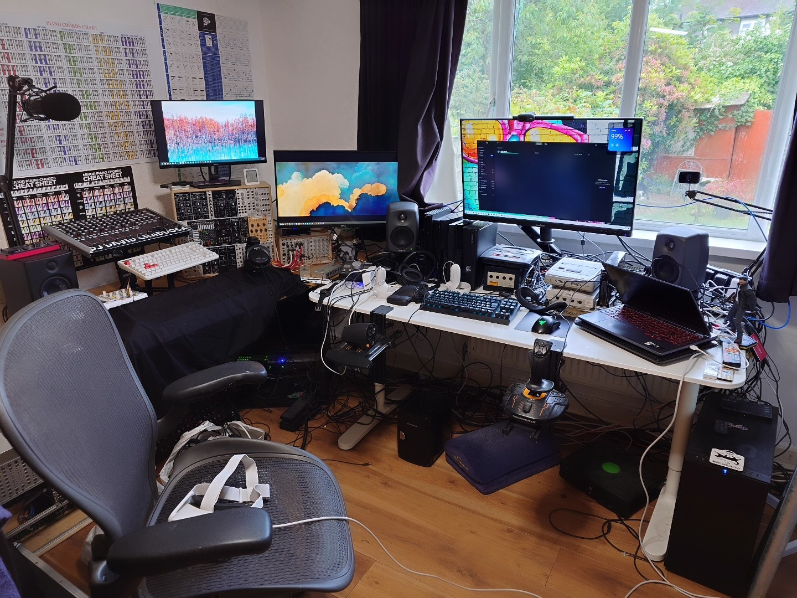
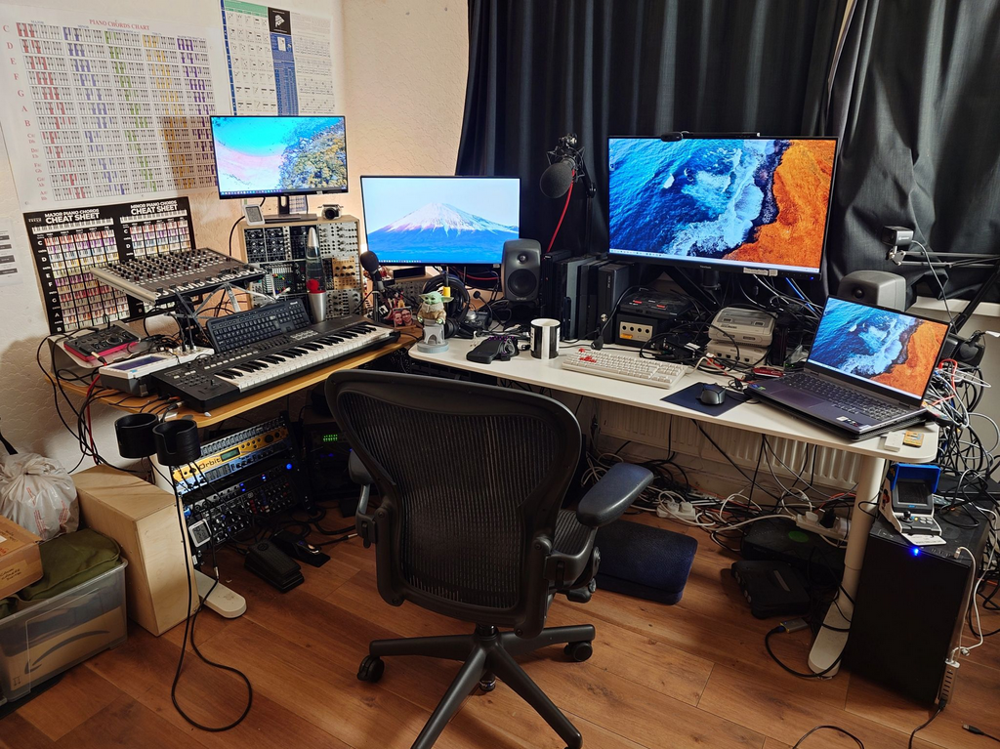






The setup consists of a media/gaming PC, a gaming laptop, a gaming PC, a music production desk, a retro games console setup, an arcade pedestal setup in front of a TV, and a lot of controllers and games.

For a post on how I built my budget arcade emulation pedestal setup, with pictures, see: [this post](https://davidcraddock.games/arcade-setup/)

### My Media/Gaming PC 'studio.local'

* 12th Gen i7 CPU
* 32GB DDR4 RAM
* 1x NVme M.2 SSD 1TB (system)
* 1x 1TB SSD
* 1x 500GB SSD
* 1x 2.5 TB HDD (storage)
* 3x Logitech C920 Webcams (for streaming)
* 1x Logitech C270 Webcam (for video calls)
* 1x Nvidia 4070 GPU
* 10Gb/sec fibre optic network card
* 2x Libredrive flashed LG-WH16NS40 multi-disk optical drivers for ripping Blu-rays, CDs, DVDs and any optical disk with MakeMKV and games for my Plex server and emulators.

### Media PC Software

* dbPowerAmp CD Ripper (lifetime licence)
* MakeMKV for ripping CDs and Blu-rays (lifetime licence)
* AnyDVD HD (lifetime licence) for ripping DVDs and Blu-rays
* 4K Video Downloader (lifetime licence) for ripping videos from Youtube etc
* Imagemagik for creating GIFs and command line batch graphics manipulation and conversion
* FFMPEG for command line batch video manipulation
* Movavai Video Editor 2022
* Sony Vegas 19 Video Editor for more complex video edits
* Aseprite Pixel Graphics and Animated Gif Editor
* Sonarworks SoundID Reference - speaker and headphones environmental EQ software.
* Audacity Audio Editor for editing and mastering mixes uploaded to Mixcloud
* Hye Sync (official app) for syncing Phillips Hue lights to movies, games, etc
* PlexAmp and Plex for streaming audio and video from my Plex server at highest quality
* VLC for video playback
* HandBrake for transcoding and compressing video
* OBS Studio (open source)
* Resolume Avenue 7 for visuals for my DJ stream
* Resolume Wire for creating custom beat-synced visualisations for my stream
* Paint.NET open source graphics program for simple crops and photo editing
* Aiseesoft Blu-ray Player (lifetime licence) for playing unripped Blu-rays on my PC
* Bome MIDI Translator Classic (lifetime licence) for translating MIDI events to key presses - useful for complex streaming setups
* Various free emulation tools for decrypting/anti-DRMing copies of video game console optical disks and getting them in a playable state for use in an emulator
* Reaper DAW (shareware licence)
* Ableton Live 11 Suite DAW
* Filebot for renaming and organising media files

### My Gaming Laptop 'legion.local'

* Lenovo Legion 5-15IAH 2022
* i7 12th Gen
* 64GB DDR5 RAM
* 2x 2TB NVME M.2 4th Gen SSDs
* Nvidia Laptop 3070TI
* Cooling Gaming Laptop Pad

### Gaming Setup

I share this setup between the Media PC and the Gaming Laptop.
I have a 4K HDR KVM switch and a USB 3.0 KVM switch so I can quickly switch between the two.

* 32" IPS 75hz adaptive refresh 1440p monitor with HDR (main monitor for both media PC and gaming laptop)
* Herman Miller Aeron Chair
* IKEA MARKKUS Chair (guest chair)
* Phillips Hue Entertainment centre with 5 light sources and Hue Sync
* Logitech G502X wired gaming mouse
* Razer Tarturus Chroma Pro Gaming Keypad
* Topre Realforce TKL UK Keyboard (main keyboard)
* Microsoft Wired UK keyboard (second keyboard used for operating while on the music production desk)
* Vertical mouse (music production mouse)
* Presonus 1824c Studio Sound Interface
* Beyerdynamic DT 880 Pro Black Edition Headphones
* Avantree Oasis Plus Certified aptX HD Bluetooth 5.0 Transmitter and Reciever
* Sony WH-1000XM3 Wireless Noise Cancelling Headphones
* Genelec 8020D Music Studio Speakers
* Presonus Eris Studio Speaker acting as a subwoofer
* Meta Quest 2 VR headset + controllers
* ClonerAlliance Flint 4KP Plus video capture card with USB-c 3.0L
* Blackout curtains
* 27" 1440p TN LCD monitor with Gsync and 144hz refresh (second monitor) (used in portrait mode for schmups)
* 19" 1080p IPS LCD monitor (third monitor)
* 40" 1080p IPS LCD Sony wall-mounted TV (fourth monitor)

### Gaming PC Software

* Playnite - this brings all my third party launchers together and collates metadata, preview videos and reviews for games I own.
* Various open source emulators - these plug into Playnite and let me play many different console games on my PC.
* Hue Sync - this allows me to sync my Hue entertainment area lights with the colours on the screen, while playing games.
* NexusMods and Vortex app - I have a lifetime membership of NexusMods, and this allows me to download, install and configure hundreds of mods for many games such as Cyberpunk 2077 and Skyrim, at high speeds.
* Special K - Allows me to tweak some games for better running, including retrofitting HDR to games that otherwise wouldn't have it.
* Razer Synapse - These allow me to create custom control profiles for some of the games I frequently play.
* Action! - Gameplay Recording and Streaming (on Steam) - for recording PC gaming
* PCMark 10 - for benchmarking hardware upgrades

### My PC Gaming Controllers

#### Joypads

These all work with the gaming PC and laptop and connect via USB:

* XBox Elite V2 White Controller
* XBox Elite V1 Black Controller
* XBOX Original "Big Duke" Controller with USB adaptor
* Buffalo SNES USB Gamepad
* PS2 Controller with USB adaptor
* PS3 Controller with USB cable
* PS4 Controller with USB cable
* SNK Neo Geo Mini Controller with USB adaptor x2 - these are extremely well-built controllers!
* XBox One Official 'Cyberpunk 2077' Controller

#### Steering Wheel and Pedals

* HORI Racing Wheel Overdrive for XBox One and PC (with pedals)

#### Retro Digital Joystick

* Speedlink SL-650212-BKRD Competition PRO Joystick - Anniversary Edition

#### HOTAS

I have two Flight Sticks and a throttle. The dual Flight Stick setup is useful for Mechwarrior style games, although I usually use the Flight Stick + Throttle for most games. They are installed on quick-release Hikig desk mounts so they can be easily setup and removed when not in use, to save space.

* 2x Thrustmaster T16000M Flight Stick
* Thrustmaster TWCS Throttle
* 3x Hikig HOTAS Mount

#### Arcade Setup

This is located on a 'pedestal' in front of the TV. It consists of the 2 Arcade sticks and 2 lightguns and a wireless keyboard and mouse.

It is connected via the gaming computer via a 4 port USB 2.0 extender over Cat6 cable, with a 10 meter Cat6 cable, so that I can play arcade games on my pedestal without lots of wires.

* Logitech Wireless keyboard and mouse (third keyboard and mouse used for operating when at the arcade pedestal)

##### Arcade Sticks

* Mayflash Arcade Stick F300 Elite with Sanwa buttons and stick using 8-way restrictor plate
* Datel Arcade Pro Joystick using 4-way restrictor plate

##### Light guns and Pedals

* Sinden PC light gun with recoil (Black)
* Sinden PC light gun without recoil (Red)
* 1x iKKEGOL USB Foot Pedal (for duck and cover mechanics with light gun games)
* 1x cheap unbranded USB Foot pedal (for duck and cover mechanics with light gun games)

##### Retro Games Consoles

I have a [Kaico Edition OSSC Open Source Scan Converter 1.6](https://kaicolabs.com/product/kaico-edition-open-source-scan-converter-ossc/), which upscales all my retro consoles to HDMI. I use cables from [https://retrogamingcables.co.uk/](https://retrogamingcables.co.uk/) with the OSSC, which are highly recommended as they make so much difference in terms of audio and video noise. The right cable can also unlock better sound and graphics quality when combined with the OSSC than was ever available before.

I also have a [Marsellie MClassic](https://marseilleinc.com/products/buy-mclassic) HDMI to HDMI hardware-based AI image improver and upscaler which I use for the output of the OSSC.

Currently these are the consoles I have hooked up. They are all 'PAL' unless otherwise specified:

* **Super Nintendo** with 2x official controllers and NTSC and J-NTSC cartridge converter
* **Sega Megadrive II (region unlocked)** with 2x official 3 button controllers, 2x official 6 button controllers and Master System cartridge converter
* **Sony PS2** with 2x official PS2 controllers, and 1 x official PS1 controller, and 2x Guitar Hero PS2 Controllers.
* **Sony PS3** with 1x official PS3 controller
* **Sony PS4** with 2x official PS4 controllers
* **Nintendo Gamecube** with 2x official Gamecube controllers
* **XBox 360** with 2x official wired 360 controllers and 360 Kinect
* **Sega Dreamcast** with 3x official DC controllers, 2x VMUs and 1x third-party memory pack
* **Sony PSP2000** (TV out)
* **Nintendo Wii (Gamecube compatible version)** with 2x Wiimote Motion controller and official balance board
* **Nintendo Wii U** with CFW Aroma installed and 1x Wii U Gamepad and 1x Wii U Pro Controller
* **Nintendo Switch Unpatched V1** with CFW installed, 2x Joycons, Dock and 1x Switch Pro Controller
* **Nintendo 64** with 2x official N64 controller, Kaico PAL N64 -> HDMI converter (audio output via HDMI), expansion pak and memory pak
* **Microsoft XBox Original** with 2x Duke controllers
* **SNK Mini Neo Geo International** with 2x official controllers, and mini HDMI to HDMI cable for monitor output (audio output via HDMI)
* **Nintendo NES Mini** with 2x controllers

##### Portable Retro Games Consoles

* **Sony PS Vita OLED 1st Gen** with cracked firmware and a 64GB memory card, allowing it to play any game from the store.
* **Sony PSP** which I have cracked, and put a 64GB memory card in it. It has a complete set of SNES and Genesis games, as well as several PS One games which the PSP can emulate. I love playing the game 'Wip3out' on it.
* **Nintendo DSi XL** which has a cartridge loader meaning I can play any games on it. Currently I mostly only use it for chess games, but aim to use it more.
* **Gameboy Advance SP** which I use almost exclusively for the game 'Final Fantasy Tactics'. I also have 4x cables to connect GBAs to the Nintendo Gamecube for multiplayer games that used this functionality, and a headphone adaptor for the GBA SP.
* Original **Gameboy** which I use with Tetris.
* **Ambernic RG35XXSP** handheld emulation device with MuOS firmware running RetroArch with a full set of Neo Geo, SNES, Genesis, Game Gear, Gameboy, Gameboy Advance ROMs.

### Audio and Video Chain Setups

#### Video Chain

So, my video setup, depending on gaming needs, is:

1.
```
All retro consoles -> OSSC -> MClassic -> 4K capture card * -> PASSTHROUGH -> Monitor (up to 4K)
                                                          \ -> RECORD -> OBS Studio stream/record (up to 1080p)
```
2.
```
All modern (HDMI) consoles -> MClassic -> 4K capture card * -> PASSTHROUGH -> Monitor (up to 4K)
                                                          \ -> RECORD -> OBS Studio stream/record (up to 1080p)
```
3.
```
Gaming PC -> Flint 4KP capture card * -> PASSTHROUGH -> Monitor (up to 4K)
                                       \ -> RECORD -> OBS Studio stream/record (up to 1080p)
```
#### Audio Chain

All cables are balanced wherever possible, and go via a balanced patch-bay.

##### INPUT

1.
```
All retro consoles -> OSSC -> 4K capture card -> PASSTHROUGH -> Monitor -> speaker stereo audio jack -> Balanced patch-bay -> Presonus Studio USB-C 1824 2x line inputs
```

2.
```
All modern (HDMI) consoles -> 4K capture card -> PASSTHROUGH -> Monitor -> speaker stereo audio jack -> Balanced patch-bay -> Presonus Studio USB-C 1824 2x line inputs
```

3.
```
Rode Procast mic w/ pop shield, mic cage and boom -> Roland E-4 Vocal Tweaker -> Presonus Studio USB-C 1824 1x mic input
```

4.
```
t.bone MB 88U mic with pop shield and desktop mic stand -> Balanced patch-bay -> Presonus Studio USB-C 1824 1x mic input
```

5.
```
Kimafun Wireless mic -> Balanced patch-bay -> Presonus Studio USB-C 1824 1x mic input
```

6.
```
Hi-fi Record Player -> Record player pre-amp -> Presonus Studio USB-C 1824 2x line input
```

##### OUTPUT

1.
```
Presonus Studio USB-C 1824 2x main output -> 2x Genelec 8020D Speakers
```

2.
```
Presonus Studio USB-C 1824 1x mono output -> 1x Presonus Eris Speaker acting as a subwoofer (with hardware EQ filtering mid and highs out)
```

3.
```
Presonus Studio USB-C 1824 3-4 headphone output -> Beyerdynamic DT 880 Pro Black Edition Headphones
```

4.
```
Presonus Studio USB-C 1824 3-4 headphone output -> Spare headphone output -> Spare/guest headphones
```

5.
```
Presonus Studio USB-C 1824 2x aux output -> Eurorack Mixer -> 2 BNC cables -> 2 channel inputs of YeaPook ADS1014D Digital Oscilloscope (for plotting waveforms)
```

6.
```
Presonus Studio USB-C 1824 2x aux output -> Eurorack Mixer -> 2 channels for small VU visual volume Level Monitor
```

7.
```
Presonus Studio USB-C 1824 7-8 aux output -> Avantree Oasis Plus Certified aptX HD Bluetooth 5.0 Transmitter and Reciever -> Sony WH-1000XM3 Wireless Noise Cancelling Headphones
```


##### PATCH-BAY

This is the patchbay mapping.

Usually I connect one or two of these patchbay sockets to the input 1 and/or 2 on the front of my audio device for recording and streaming.

1.
```
Left HDMI audio output from gaming monitor (used for OSSC and retro console gaming)
```
2.
```
Right HDMI audio output from gaming monitor (used for OSSC and retro console gaming)
```
3.
```
R0de Procaster Audio mic with boom via a Roland E-4 Vocal Tweaker
```
4.
```
tbone MB 88u Audio mic with desktop stand, used for as a secondary mic
```
5.
```
Kinafun Wireless trasmitter/reciver for Kinafun wireless mic headset
```
6.
```
Marshall MG15G Guitar Amp for playing my electric guitar
```


#### MIDI Routing Chains

##### OUTPUT

1.
```
Presonus Studio USB-C 1824 Midi Output -> Kenton MIDI Thru -> CV.OCD Polyphonic MIDI to CV Convertor -> Eurorack
```
2.
```
Presonus Studio USB-C 1824 Midi Output -> Kenton MIDI Thru -> Emu Orbit 9090 Synth
```
3.
```
Presonus Studio USB-C 1824 Midi Output -> Kenton MIDI Thru -> Lexicon Reverb Unit (for midi clocked effects)
```
4.
```
Presonus Studio USB-C 1824 Midi Output -> Kenton MIDI Thru -> Roland E-4 Vocal Tweaker (for midi-synced pitch effects)
```

##### INPUT

1.
```
Roland A-500 Pro 49 Keyboard Controller -> Presonus Studio USB-C 1824 Midi Input
```

### My PC and Console Games

I collect physical and digital games, both modern and retro. You should able to browse through the games I have, both on PC and console, here: [https://wordswords.github.io/media-library-homepage](https://wordswords.github.io/media-library-homepage)

I also have an install of [ExoDos](https://www.retro-exo.com/exodos.html) and [ExoWin31](https://www.retro-exo.com/win3x.html) on my media PC, which allows me to play any game ever released on DOS and Windows 3.1.

### Living Room TV Setup

We have a separate minimal setup in our living room which my wife uses heavily. It is minimal because she doesn't like overcomplicated tech stuff :) It consists of:

* Sony BRAVIA 2023 Edition, KD-43X75WL, 43 Inch, LED, Smart TV, 4K HDR, Google TV

Because it has Google TV, we can use the Plex app to wirelessly stream 4K videos from my Plex server, and it handles 4K videos well, which is not a small feat as the wireless signal is being blasted through a concrete wall :) Netflix and all the other standard services also work well.

