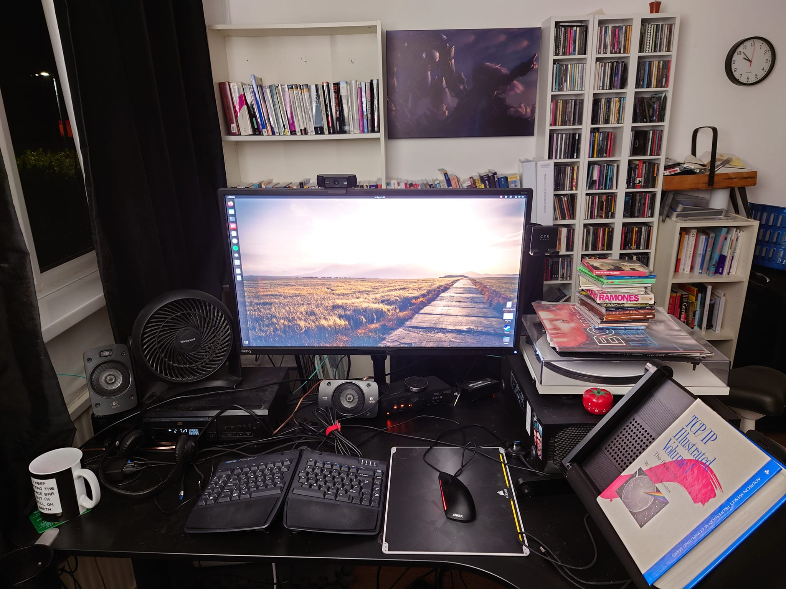

This is my work from home setup. I work from home every work day. I use the following equipment:

- HDMI, network cables and and USB hookups for 2 additional laptops if needed
- HDMI Switcher
- USB Switcher
- IKEA Motorized Standing Desk
- Benq 32" 2560x1440 graphic designers monitor on Amazon Basics extendable desk mount arm
- Honeywell desk fan
- Logitech 5.1 surround sound system with 5 speakers and subwoofer
- Sony WH-1000XM3 Apt-X HD Noise cancelling headphones with an Avantree Oasis Plus Apt-X HD bluetooth transmitter, so I can listen to any of the music devices on noise cancelling headphones
- Ergonomic book stand for textbooks
- ThinkStation Xeon workstation/server running the latest Ubuntu
- Fibreoptic 10Gb/sec DAC cable routed from my ThinkStation server to my personal computer downstairs for fast data transfer
- KVM switch and full hookup for work laptop
- Drinks holder
- Groot from Guardians of the Galaxy Phone holder
- Johnny Silverhand Plushie from Cyberpunk 2077
- Pomodoro timer
- Standing desk mat for easing long standing experiences
- XL rocker style wooden balance board
- XL 360 style wooden balance board
- Fast Anker USB charger
- Logi USB headset with noise cancelling microphone
- Kinesis Freestyle 2 ergonomic keyboard
- Anker vertical mouse
- Apple Magic Pad 2 that I've made work with Ubuntu - I use this in preference to the vertical mouse as I've found it much more comfortable in most cases.
- LogiTech C920 web cam
- Colour laser printer
- Flatbed scanner
- IKEA MARKKUS chair with the armrests removed as they are not adjustable and therefore not ergonomic
- 1800ml vacuum thermos flask for storing water and keeping it cool (keeps it cool for 24 hours, hot for 12 hours)
- USB Foot Switch Keyboard Pedal for using with VIM (insert mode/normal mode toggle)
- Mini fridge for Pepsi Max cans
- Logitech Key light for web cam calls
