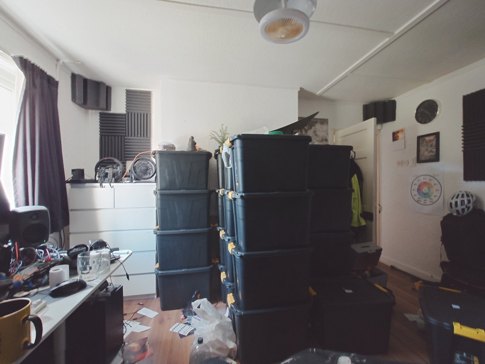
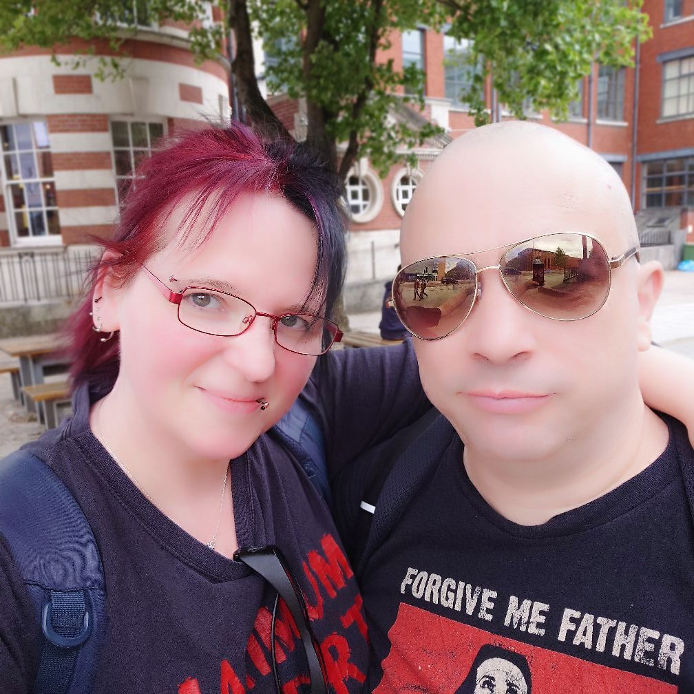

+++
title = 'Mid 2025 Retrospective'
date = 2025-08-15T02:19:58+01:00
draft = true
+++

Moving House

This year has been difficult so far, although arguably not as difficult as last year, as last year saw deaths in the family and still not knowing if I'd been cured from cancer.

Almost all of the year we have been trying to sell the house and waiting until the house sale goes through.

It is *nearly* there, but then.. it's been *nearly* there for several months now. We just have to be patient.

I've started a Masters degree in Cyber Security at the University of London Royal Holloway, which is something I've always really wanted to do.

It is very difficult managing finances at the moment as a very impoverished student but somehow we are still surviving.

My health has not been that great in the last couple of months, mainly because of the stress of selling the house, and the financial pressure of not working while studying.

In terms of physical fitness I am fitter then I have been for a while as I have been cycling everywhere for a long time on my ebike.

I did start DJing again, but stopped again. I really don't think that the demands of 'the scene' are any good for me anymore - I'm not the same person I was in my 20s, and I really can't be drinking large amounts of alcohol on a regular basis - it's simply not possible for me personally to maintain good health while doing that.

It is very worrying hearing about all the offshoring going on in the software industry and how difficult it is to get into tech work. My age and health problems do and will count against me going forward, so I just have to position myself in a job where these biases are minimised in the view of the hiring manager.

I have to remember that I've got through much worse times, and I just need to keep going and not lose hope.

On the plus side, I've started a retro-gaming meetup which has been fairly successful so far, and which I enjoy quite a bit, and met new people through that, and met some other people through other social groups too.

Hopefully by the end of the year the house sale will have completed, and we'll be in a better place in a lot of ways. They say that selling or buying a house is one of the most stressful things you can do, and I absolutely believe it in this instance.

Looking shady

