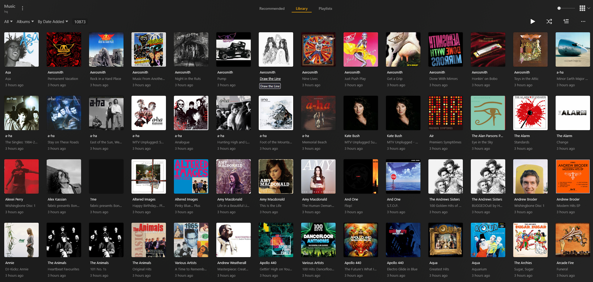

+++
title = 'My Plex Music Import/Music Library Tidying Process'
date = 2025-04-10T13:24:54+01:00
draft = true
+++

## Introduction

I have been working on perfecting a data-cleansing and import process for my [Plex](https://plex.tv) Server's Music library for several years now, on and off.

What started as a process to acquire, sanitise and prepare music for DJing, has grown primarily into a process to acquire, clean and prepare music for streaming via [PlexAmp](https://www.plex.tv/en-gb/plexamp/) from all my devices, including outside my home network, from my Plex server.

## Music Import Process

### Acquisition

Either:

* Via [Lidarr](https://lidarr.audio/) the torrent management system that intelligently downloads music, and automatically fills holes in your music collection, coupled with [Prowlarr](https://prowlarr.com/).
* Via FLAC files being ripped on Windows via [DBpoweramp CD ripper](https://www.dbpoweramp.com/) and placed in a [samba](https://www.samba.org/) share 'incomingmusic' on the server.
* Via any FLAC or MP3 files being placed in a samba share 'incomingscratch' on the server.
* Via files being downloaded from [HumbleBundle](https://humblebundle.com)'s audio bundles, and also paid sites such as [Bandcamp.com](https://bandcamp.com), and placed in a samba share 'incomingmusic' on the server.
* Via ARM - [Automated Ripping Machine](https://github.com/automatic-ripping-machine/automatic-ripping-machine) running on the Linux server for headless automatic ripping of music CDs - currently I do not rip music CDs automatically with ARM although I probably will re-establish this acquisition path in the future.

### Sanitisation

* FLAC files get checked with the [FLAC integrity checker](https://github.com/bluemoehre/flac-integrity-script) and any ones that fail to pass the test are deleted. The integrity checker runs on every FLAC file in my collection once every 30 days.
* MP3 files get checked with [mp3check](https://code.google.com/archive/p/mp3check/) and any data outside of the official MP3 headers are deleted. This removes any spurious information and also saves disk space.
* Any files and directories not consisting of MP3 or FLAC files, such as covert art image, text file logs, etc, get deleted to save space.

### Preparation

I run [Filebot](https://www.filebot.net/) that handles organisation, renaming and the folder structure of the music library according to what Plex expects, and also refuses to process corrupted files or spurious files as an extra step.

## Frequency of Music Import Process

The music import process is a number of bash scripts that run automatically once per week via [cron](https://en.wikipedia.org/wiki/Cron) in a [no-hup'd](https://www.digitalocean.com/community/tutorials/nohup-command-in-linux) [screen'd](https://www.gnu.org/software/screen/) environment.

## Conclusion

I find that this approach works well, and runs within an acceptable amount of time on my current music file library, which is extremely large at 1.5TB. Previous approaches using [beets.io](https://beets.io) simply did not work for me, as I couldn't get beets to scale to music libraries of this size and it was forever corrupting its database.

