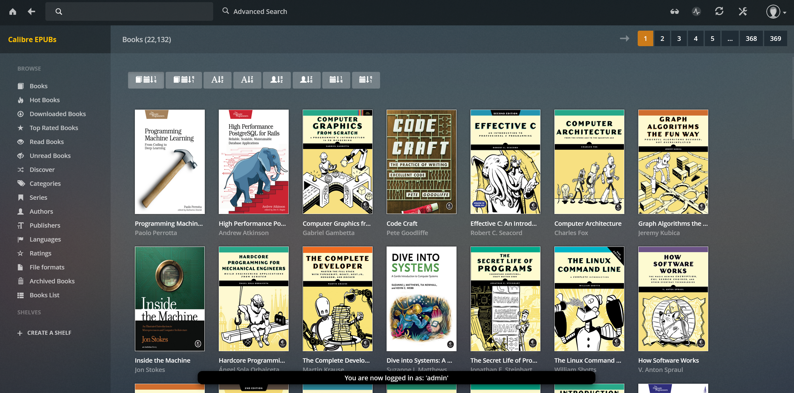
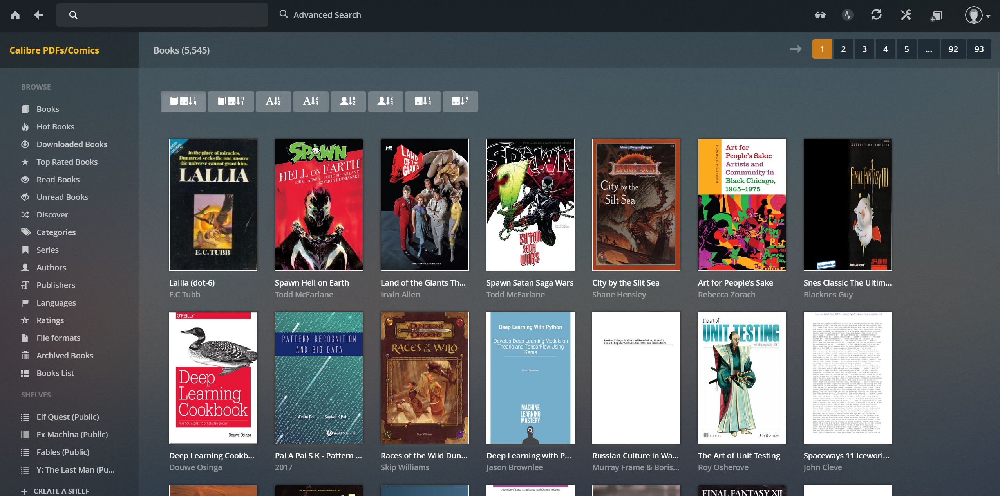

+++
title = 'My Calibre Libraries'
date = 2025-03-05T01:12:39Z
draft = true
+++

On hq.local, I have two [Calibre](https://calibre-ebook.com/) libraries, one for EPUBs, and one for PDFs/comics.

## Size

There are approximately 80,000 books across both libraries.

* [Ebooks Inventory plus counts](https://home.davidcraddock.net/ebooks-inventory.html)
* [Comics Inventory plus counts](https://home.davidcraddock.net/comics-inventory.html)

## But.. WHY?!

I use both libraries both for recreational reading, (mostly comics and some written fiction) and research for work, as a tech worker, and as an aspiring 'renaissance man'.

## Hosting

* They are managed by [Server.io's Calibre docker containerised services](https://docs.linuxserver.io/images/docker-calibre/). They are both running Calibre content server to serve directly to my e-readers. [I also use Calibre Web Automated docker containerised services](https://github.com/crocodilestick/Calibre-Web-Automated) for both libraries.
* So in total, there are three services hosted, and three ways of accessing each Calibre library, per library - 1) the Calibre application running via a web-based remote desktop client, which I use for serious administration, but only sparingly as it takes up a lot of server resources when connected 2) The Calibre content server accessible on my e-readers and 3) The Calibre Web interface which I use to browse and read the books on computers.

## Sources

* I have built them up primarily from [HumbleBundle.com](https://HumbleBundle.com) book purchases, where the majority of the money goes to charity, and I still get a good set of e-books.
* I also 'inherited' a large collection of already DRM-stripped fiction books from a friend.
* Occasionally I use resources such as [Anna's Archive](https://annas-archive.org/) to download DRM-stripped books.

## Access

Both libraries are accessible via my [ZertoTier VPN](https://www.zerotier.com/). I use the [Moon Reader](https://www.moondownload.com) application on Android devices to access the Calibre content server port, and I use the Calibre content server web interface on my [Kobo H20 E-Reader](https://www.kobo.com/).

## Ingest

* I have two Samba mounts which I use across my network: 'incomingebooks' and 'incomingcomics'. Mostly these are added to by my Windows 11 PCs, which I use most of the time.
* Any files put in those shares will be automatically picked up my Calibre Web Automated's regular ingest run, and converted to epubs. I then clear down the directory regularly.
* I used to keep PDFs seperate and manually import them via the Calibre remote desktop via web, but I don't see a disadvantage in converting the PDFs into epubs in the comics/PDFs library.

## Reading

I have three e-readers.

* A 2020 [Kindle Paperwhite](https://www.amazon.co.uk/kindle-paperwhite-2024) which is not used with Calibre, instead it's used with the 100 or so books I have bought on Kindle throughout the years.
* A [Kobo H20 e-reader](https://uk.kobobooks.com/products/kobo-libra-h2o) which is used for EPUBs only, and can access the Calibre EPUBs content server via wi-fi while I'm in the house to download books.
* A cheap 2024 Lenovo android tablet, which I use for both PDFs/comics and EPUBs, via the [Moon Reader Android app](https://www.moondownload.com/]). It also has a SIM card with a 4G data connection with a small amount of monthly data use quota, so I can connect to my VPN and download books while out of the house. This is my preferred e-reader at the moment due to the good quality colour display, which is good for reading PDFs/comics. I have stripped all the other applications and distractions off there.

I also have [Moon Reader](https://www.moondownload.com/) on my Android mobile phone, with access again to both libraries via VPN.

## Other Libraries

* I have a separate collection of over 400 physical books which I keep catalogued on [GoodReads](https://www.goodreads.com/review/list/22437975).
* I have a small collection of around 100 Kindle DRM'd books which I'm slowly cataloguing on [GoodReads, on the Kindle shelf](https://www.goodreads.com/review/list/22437975).
* I have a small collection of around 100 Kobo store DRM'd books which I'm slowly cataloguing on [GoodReads, on the Kobo shelf](https://www.goodreads.com/review/list/22437975).

