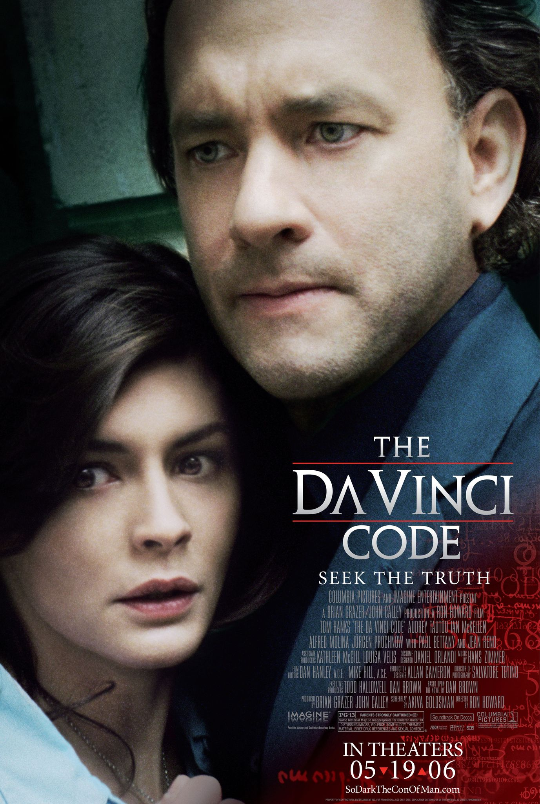

+++
title = 'Starting Masters Degree'
date = 2025-03-28T04:32:52Z
draft = true
+++

* Fun party fact: University of London, Royal Holloway was mentioned in Dan Brown's book 'The Da Vinci Code' as the university the Cryptographer heroine studied cryptography at Royal Holloway, in which would have been the [ISG department](https://www.royalholloway.ac.uk/research-and-education/departments-and-schools/information-security/), where I am to be studying!)

* Finally, after many many years of consideration, deliberation, hesitation, and procrastination, I have started a Masters degree at Royal Holloway, University of London. It is a distance-learning degree, and it is delivered in a part-time format, so it means I can fit it around (some) work.

* It will take a minimum of 2.5 years, and a maximum of 5 years. Royal Holloway is a world leader in Cyber Security education, and this is a distance learning version of the very first Cyber Security masters degree in the UK, started in 1992!

* I'm VERY excited about starting it. I have 20 years experience as a software engineer, including development, devops, SDET and exploratory testing, so I'm looking to target Red Team/Pentesting work and/or security research when I have graduated.

* While I am studying, assuming workloads are manageable, I hope to take the time to complete at least an OSCP certification.

* In order to do well on the degree, I am in the process of selling my house in Manchester,UK partly to fund some time off so I can complete these intensive studies. We also aim to relocate to Berlin this year, where my wife is from.

* The German government has recently approved at least 500 billion euros in defence and infrastructure spending, a large part of which is going to go towards developing their cyber security capacities, so I hope that I will be able to find work in this area in Berlin when I move.

* I am so excited to be able to dedicate a sizeable amount of time off-work to my own learning, in a university environment, and think that it will pay off long-term in improving my career prospects, and should result in increasing my ability to find work I actually enjoy.

