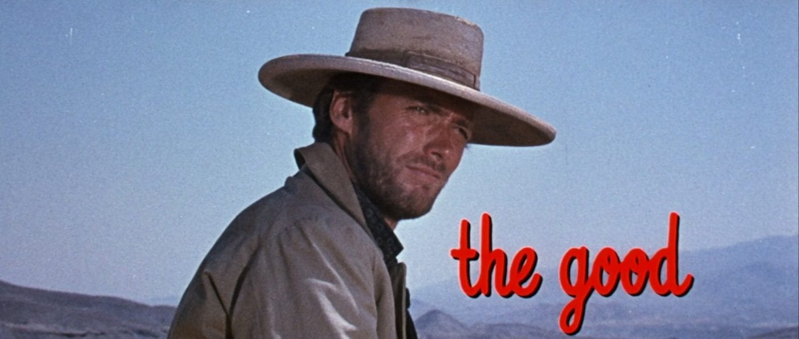
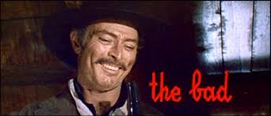
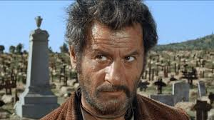

---
category:
  - retrospectives
date: "2024-12-22T19:30:59+00:00"
guid: https://davidcraddock.net/retrospective-for-2024
title: Retrospective for 2024
url: /2024/12/22/retrospective-for-2024/

---
The year of 2024 comes to an end, and what a year it has been!

As I usually do, I post (at least) yearly retrospectives, covering my life in the past year. This is one I posted mid-year 2024, and this 2023s.

It is meant to inform people outside my inner social circle how my life has been going - to give an overview that people who talk to me every day may not have, for example.

I usually separate the points into 'the Good', 'the Bad' and 'the Ugly'.

### What Has Happened

## 'The Good'

* My cancer still shows no sign of coming back. Apparently the likelihood of it returning is now 'within the single percentage figures'. Which, as much as I found my experiences with the NHS and the Christies [link] difficult, is an amazing result for all concerned.

* I gave up DJing, as it was not giving me the pleasure it once did. I was getting very frustrated by the 'DJ scene' on Twitch.tv [link]. They were not the same kind of people as I was any more, and did not, I felt, stand for the same things. I have sold or given away all my DJ equipment.

* I replaced my DJing hobby with cycling my e-bikes. I have two e-bikes now [links here], which combined are a more than adequate car replacement, as we live in the city. Conny often cycles one while I cycle the other, and we take them on trips, which is a cost-saving nice way to exercise as a couple. I have a full set of all-weather winter and summer clothing and equipment so there is no reason to stop cycling when the weather changers.

* Between work commitments, I took on a 300 mile cycle challenge and beat it within 10 days, which took a lot of personal endurance [link]. It was very satisfying and I raised quite a lot of money for cancer research.

* I started volunteering for Chorlton Bike Deliveries [link here], using my electric bike for a beneficial cause. I currently deliver shopping for a disabled person, and also pick up excess food from supermarkets and take it to food banks. I find this very rewarding - it is nice to be able to give back to the community.

* I started taking on paid bike delivery rides. Currently I'm being paid to pick up medical samples from GP surgeries and deliver them to Withington Hospital for analysis. I have also done some catering runs from ethical vegetarian/vegan restaurants and delicatessens, and a number of other rides.

* Conny and I have both got 'Fit Bit Inspire 3' fitness trackers [link], and this has really helped us massively 'step up' the amount of exercise we both do, while continuing to eat a healthy diet. This has had a huge effect on how positive we feel about life, and how we are able to take the 'knocks and swings' of life. Conny also completed a difficult sponsored charity challenge of her own, for a charity for Stillborn parents [link], which I'm very proud of her for achieving.

* After selling all my DJ equipment, I have converted my music studio into a general purpose 'workshop' and have made an amazing gaming setup now for my retro consoles, arcade games [link here], and modern PC games. I have wired everything up to Google Home Assistant voice control, so everything is easily configurable and shuts down automatically to save power when it is not in use.

## 'The Bad'

* I am currently 'in between' full time jobs. I am looking to transition into the cyber security industry, as I've really had enough of my time in normal software engineering. It has changed so much since I first got into it in the 00s, and the level of appreciation, autonomy and respect that I get for my experience and skill set has much reduced, even though bizarrely, my income has continued to increase! This career change and the necessary time out of work it requires, has put pressure on the family finances, although I have good reason to think this is only temporary.

## 'The Ugly'

* My mum unfortunately lost her battle to Multiple Myloma cancer [link] this year, after a heroic struggle of 10 years. This has devastated the family, as she was in a lot of ways - the head of the family, and her driving will-power kept us all in line.  For me she will be remembered for the many things she achieved in life, the kind things she did, and being a personal inspiration for me during my cancer fight.

* We also lost my father-in-law, Conny's dad, a few weeks later, which was a huge shock and very unexpected, to natural causes. Conny has had a lot to deal in these past few months as she was close to my mum as well.

### Summary

There obviously have been some major bad events happening this year, particularly in the final quarter. However, it's important to note that a lot of good stuff has happened too, particularly around mine and Conny's health. I am also glad that I 'moved on' from the DJing stuff I was doing before and replaced it with more healthy hobbies.

I feel that we are both in a good position to head into 2025 now, and to 'climb the hill' of making things get better for us in other areas too.
