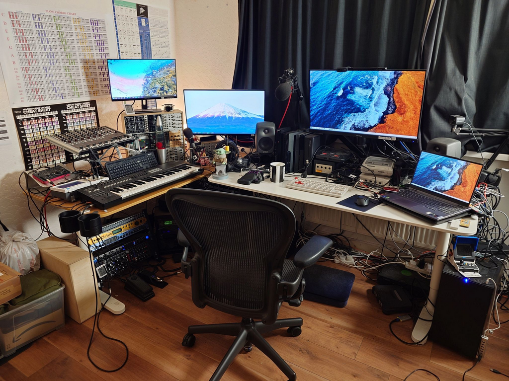

---
category:
  - retrospective
date: "2024-10-29T00:03:36+00:00"
guid: https://davidcraddock.net/life-maintainace
title: Life Maintenance
url: /life-maintaince

---

 I have been taking some extended time off work for the past month, to deal with my mum's illness and unfortunate passing away, and because my work situation is so bad it's borderline horrific.

One thing that has cheered me up a bit is what my wife C. and I have been able to do to the house and to work towards our personal goals in this time.

* We have transitioned from being a 1 vehicle household to a 2 vehicle household (2 e-bikes of course, no way could we afford cars!). This has involved a lot of work setting up a secure lock-up for our bikes, installing accessories, making the cargo bike useful for an every day car replacement, etc etc

* C. and I have both been exercising a lot more than we used to. We have both lost a lot of weight and feel better about life in general because our physical health has improved. This has had a positive affect on our mental health as well.

* C. and I have nearly finished transforming the 'Dave Cave' aka my 'man cave' from a DJ studio into a more general purpose room. All the electrics are controlled via Phillips Hue and smart plugs with Google assistant, meaning it is much easier to maintain and use going forward. We have put up 'hooks' to hold our many rucksacks to clear the floorspace to be able to use the robot vacuum cleaner more, and so that it is as easy as possible to just get on our bikes and go at short notice, without having to prepare/pack everything. We still have some more stuff on the floor to sell on Ebay, but it's a lot clearer and more useful (and maintainable) than it used to be!

* My [gaming setup](https://davidcraddock.net/my-gaming-setup/) is much better than it used to be, as I have installed a Nvidea 4070 graphics card in my main gaming PC, and moved my [Playnite](https://playnite.link/) setup from my gaming laptop to my gaming PC. I have also expanded the retro console gaming shelving area, and C. opened and cleaned all my retro console cartridges with rubbing alcohol. I have three monitors and one TV connected up to the setup, and all wired up properly with all my consoles with AV switchers. I also have a [Sinden light gun](https://sindenlightgun.com/) on the way, which I'm very excited about, as I will be able to play House of the Dead and Time Crisis.

* We have sold and given away an absolute TON of stuff, to charity and to friends. A lot of my DJ equipment has been passed on (not unlike the olympic torch) to my DJ friend M. who has been making good use of it. I have been ripping a lot of blu-rays to put them on the [Plex server](https://plex.tv) and donating them to charity.

* My music production setup is coming on, after I dramatically downsized my modular synthesiser and got rid of all but the most essential hardware synthesisers. I have connected all audio sources up to my patchbay and documented all connections, as well as installed [SonorWorks SoundRef](https://www.sonarworks.com/soundid-reference) and EQ'd the acoustics of my room with a measurement microphone I borrowed from my musician friend E. There is still work to do - I need to wire up all the MIDI routing so that I can properly control all the synthesisers and use my MIDI arp, and also setup Ableton Live Suite on my main PC and activate all the plug-ins, but it's coming on.

* I have been slowing moving all my domain names and websites to being self-hosted on my server. Now I have a 2gbits/sec internet connection, the fibre-optic [network](https://davidcraddock.net/my-home-network/) I build into the house while I was having cancer treatment really has become very useful. We have 2gbits/sec from the server, and also my gaming/media PC. My website [davidcraddock.net](https://davidcraddock.net) is looking a lot more how I have wanted it to be for a while.

* I have been upskilling in [Cyber Security](https://davidcraddock.net/security-research) for a career change to [pentesting](https://en.wikipedia.org/wiki/Penetration_test), including working on hobby cyber security projects such as wireless pentesting. I have built three devices that allow me to manipulate and capture password hashes from wireless access points, to crack them. I have setup a distributed password cracking setup using three computers with gaming graphics cards. I am also going through online courses to increase my understanding of pentesting.
