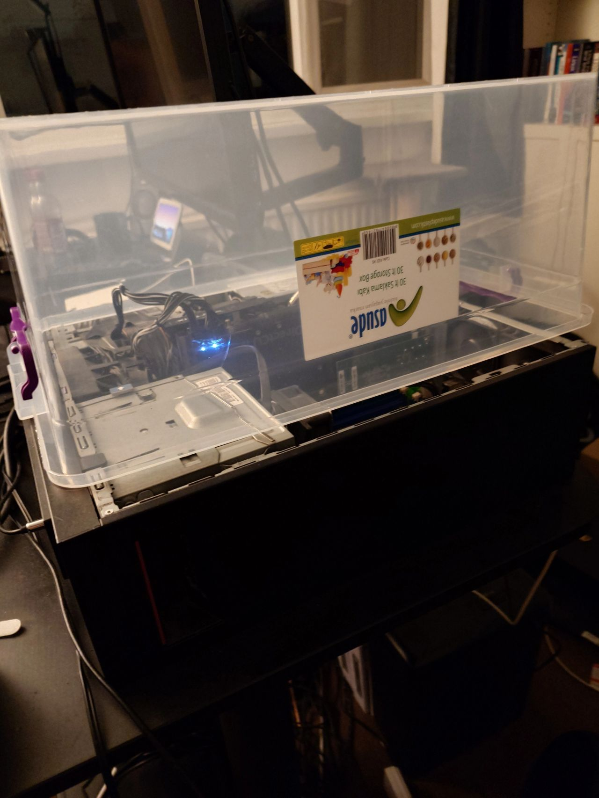
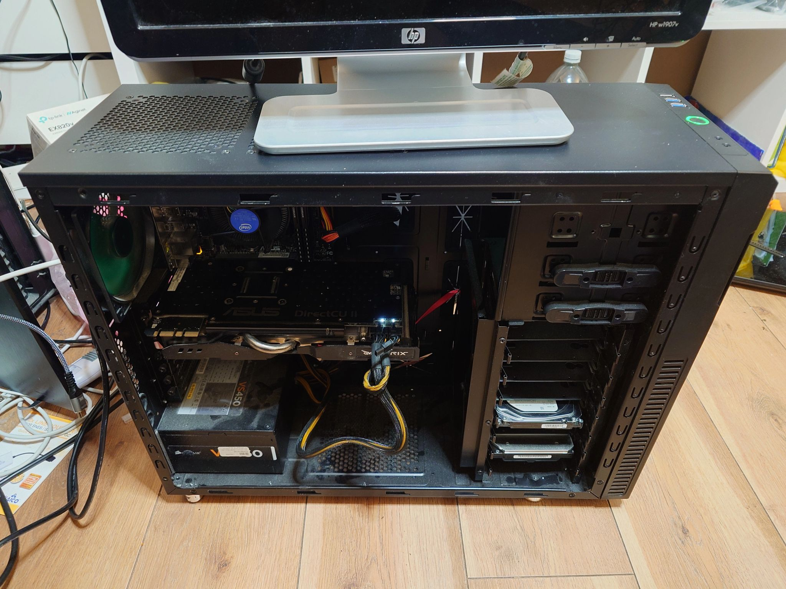

---
category:
  - tips
date: "2024-12-12T00:00+00:00"
guid: https://davidcraddock.net/?p=4980
title: Server Outage Dec 2024
url: /2024/12/12/server-outage-december-2024-12/
image: oldserver.jpg
author: David Craddock
---

I got into a bit of a situation where I broke the main server.

Instead of replacing it, I decided to wait a few weeks until I had access to a new case, mobo, CPU and PSU so that I could move it into that case, and take advantage of my Nvidea 970 graphics card.

Previously the card WAS in the server, but there was one main problem, the graphics card wouldn't fit in the case, see here:

Now the server is rebuilt into a new case, there are zero problems, and this case is soundproofed so there should be no problem keeping it in the 'Dave Cave' room I used for my music studio. It will also disturb guests less, as when people stay over they usually sleep in the study where the old server was.

Thankfully, as almost all of the configuration for the server is stored in repositories and properly backed up, it was not that difficult to rebuild the server and get everything working again.

Well, when I say 'not that difficult' - it only took about 12 hours!

A nice and unexpected benefit of rebuilding the server into a case that can accept that Nvidea 970 graphics card, is that my wife has noticed a big improvement in the Plex server loading times.

She is now able to 'scrub' (as in fast forward and rewind quickly) 4K content on the 4K TV in our living room with zero buffering, thanks to the transcoding capabilities of the Nvidea 970.

This makes it easier to quickly seek through a large film for the bits she missed.

